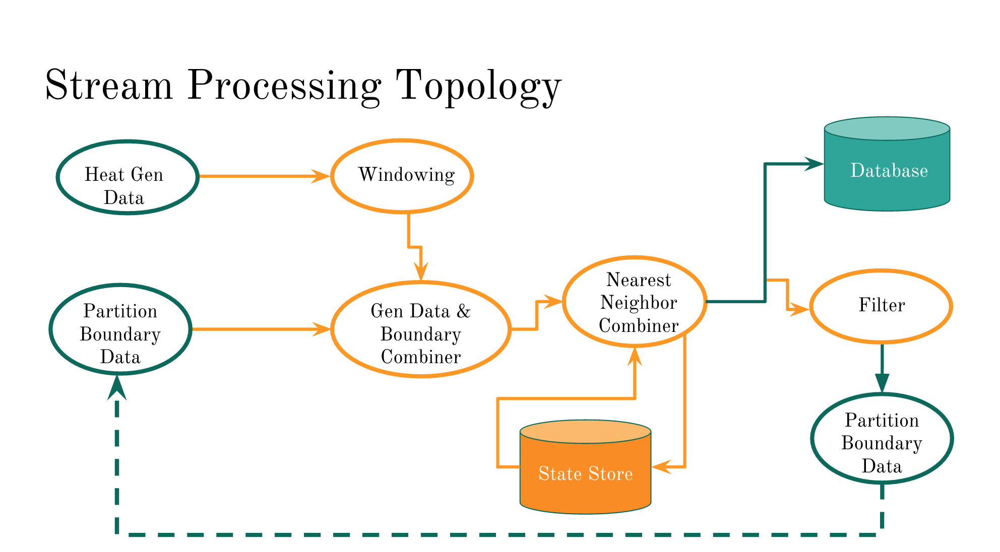

# [It's Roasting in Here!](http://nestedtori.tech)
Insight Data Engineering Project: Streaming Heat Generation Data and Solving the Heat Equation

---
## Table of Contents
1. [Introduction](#intro)
4. [Pipeline](#pipeline)
2. [Implementation](#implementation)
3. [Cluster Structure](#cluster)
5. [Presentation](#presentation)
6. [Scaling and Performance](#scaling)

Please visit the [Demo Page](http://nestedtori.tech). Note you may need to reload the browser a couple of times for it to start up correctly. Also see the [Presentation](http://bit.do/its-roasting). It's a more concise summary of what's here.

## <a name="intro"></a> Introduction
The process of diffusion is a well-known one in the physical sciences, and has been used to successfully model the spread of many things that are not necessarily motivated by physical processes (we'll see some examples when we discuss what kind of problem this really turns into). For this project, however, we'll focus on a venerable and favorite diffusion problem, that of heat propagation. We show how this type of problem can be recast as a very common streaming problem, that of stateful streaming.

### Mathematical Description: the 2D Heat Equation
This section is optional; it describes the underlying mathematical derivation of the equation we'll present in the next section. We consider the heat equation for temperature _u_ of a continuous system in a planar domain. Here, _u_ = _u_(_x_,_y_,_t_), a function of two space coordinates and time, measured in, say °F or °C. The equation is:


where _k_ is a constant called the _conductivity_

,

the 2D Laplace operator, and _f_ is the rate of heat generation at each point in the domain (measured in something like calories per second, or some other relevant proxy, such as number of instructions per second–you'll need an extra constant in that case). Intuitively, this means the time rate of change of the temperature is proportional to the (negative) of how the heat is concentrated. To all this, we add the heat generation data. The purpose of the ∆ operator is to capture the fact that heat _diffuses_ throughout space as time passes, thus making the problem more complicated than just working with a single rate of change and integrating (which would be an _ordinary_ differential equation rather than _partial_). Even if there's _no_ input (or if the input suddenly cuts off), _u_ continues to change as heat spreads and dissipates. We have to add boundary conditions, which is what happens at the boundaries of the region. For this problem, we choose the boundary condition of _u_ = 0 (called "Dirichlet conditions"), which represents a heat sink on all boundaries.

To solve this numerically, we have to discretize in both time and space. For the spatial part, we'll assume it's a bunch of rectangular grid points as follows:


_u_ is now represented as a matrix _u_<sub>_i_,_j_</sub>  with each entry corresponding to the grid; in common programming languages, it looks like `u(i,j)` (MATLAB-like languages) or `u[i][j]` (C-like languages), or just some positional function like `u.at(i,j)`. The operator Δ takes the form of a centered difference, using the points in a _stencil_: the use of the 4 nearest neighbors along with the central points:


For a grid size _h_ we add the value of _u_ at the point to the left and right, and subtract twice the value of _u_ (this is discretizing the 2nd _x_-derivative) and then take _u_ at the points above and below, and finally subtract twice the middle again (for the 2nd _y_-derivative). Finally, we divide by the square of the grid spacing _h_.

In formulas, this looks like


Now, we have to discretize time, as well. We use the well-known _forward Euler_ method, which is a very simple algorithm, stable for sufficiently small timesteps (which we will call τ). Namely, the time derivative is estimated with a forward difference: at time _t_,


(We have suppressed its dependence on _x_ and _y_ for clarity of notation, but keep in mind it still depends on _x_ and _y_!). What we'll do is assume timesteps are always uniform, so we can compute a sequence of heat maps _u_<sup>_n_</sup> (_n_ is an index, not an exponent, but it is written superscript because the subscript level has already been crowded by the matrix indices _i_ and _j_. In actual implementation we won't need this third layer of indexing, however), with the formula


Therefore, applying both discretizations to


we get (restoring the dependence on the matrix entries)


and solving for the "future" timestep _u_<sup>_n_+1</sup> in terms of the present one,


### Algorithm
We have so far derived the relation

.

It is convenient to combine all the constants in one (we'll call it _C_). Many mathematicians prefer "nondimensionalization" where they set all constants to 1, but it is at the cost of having to figure out exactly what simulation parameters the equation actually represents. So we'll at least keep _C_ around.

Let's translate this into a form suitable to programming in a streaming framework. First, noting that the superscript _n_ is for time, we see that it only depends on one previous time step, so that we can conceive of this as updating one variable. Here by "variable" we actually mean a full 2D array variable. In traditional programming applications, states are precisely what is modeled by variables. In streaming applications, state variables are stored separately in a cache-type database, such as RocksDB. After doing the whole update computation above, we also write the state out to a more permanent database, so that we no longer have to keep all the time steps (indexed by _n_) in memory. We only need to keep the old state, and update it to a new state.

The data _f_ is the input stream that we would like to combine with the stored state to give an output stream of temperature (which also will be stored as the next state). More details on how this streaming is structured is done in [implementation](#statestream). Let's take a look at the big picture.

## <a name="pipeline"></a> Architecture


Each sensor in the array is assumed to send approximately 10 messages a second. In 30 x 30 square array, this can amount to around 10000 messages a second. Data is fed from this sensor array[<sup>1</sup>](#foot1) into a single Kafka topic `heatgen-input`; each topic partition corresponds to a range of columns in the input data. The input data schema is

```{"time": "long", "gridX": "int", "gridY": "int", "gen": "double"}```.

This would be suitable for Avro, but I chose to directly write serializers and deserializers for Kafka as it was simpler to set up.

Next, we use Kafka streams to process this data. For a non-parallelizable version of this (only one partition in the input Kafka topic), this is very straightforward: use a windowing transformation to round timestamps, combine it with information in the state store using the update algorithm described above, and save the new state, before writing it out to Cassandra (through the topic `temp-output`). In order to be able to parallelize the computation (and now use a partitioned version of the input Kafka topic), we need another topic, `partition-boundaries`, that holds partition information between timesteps. We will describe this in more detail in [Stream Processing Implementation](#statestream). For the output, the schema is very similar to the input:

```{"time": "long", "gridX": "int", "gridY": "int", "temp": "double"}```.


Bokeh reads the data in from the database and plots a heat map (each node is represented by a small circle). Cassandra is actually better suited to the batch version of this project (we'll describe in detail later about the batch vs. streaming implementations); originally, I envisioned being able to look at and replay past data. Perhaps a database with a push capability (such as RethinkDB) would be more appropriate for the streaming version, and indeed, something to experiment with given more time.

## <a name="implementation"></a> Implementation

### Batch Version
To validate the concept and get some hands-on implementation of the algorithm, I developed a batch version of this project using Spark (it is in the main `its-roasting` directory, and the Scala code is in `src/main/scala`). The relevant demo is `roasting_ui_b` on the [Demo Page](http://nestedtori.tech) This batch version generates perfectly aligned timestep data and ignores the windowing problem we set out to solve. Here, the variable `u` is maintained as a range-partitioned RDD, and the heat generation data is directly synthesized in the code as a random number generator. At each timestep, each dot will generate heat at 4 temp units per unit area per unit time, with a probability of 1%. To run this version, run the script `run.sh` (you can adjust parameters such as the grid size, heat generation rate, and probability one single dot will flash, inside the script, as the program takes those parameters as command-line arguments). This produces a very pretty demo without any missing points, but Spark does this job far slower than real time. It took 90 minutes to generate about 9 minutes worth of data (10 times slower). This is very possibly because RDDs are very robustly equipped with the ability to communicate with other parts of itself, spread over different threads and machines, and able synchronize correctly. This probably results in far more overhead than we need for our problem, thus slowing things down by a lot.

### <a name="statestream"></a>Streaming Version
The streaming version is available in the `its-roasting/heat-gen-processor` directory (despite the nesting of the directory structure, the batch version does not rely on any components of the streaming version, and vice versa; they are totally separate programs). It operates as follows. For a single-threaded version, the structure is not that different from batch: once we round off the timesteps (initial data is provided by a Kafka producer, feeding into a topic `heatgen-input`), the sequence of operations in the stream is exactly the same: read in the current state, map the current state into its neighboring and current values, add in the streaming term, and output the result to a Kafka topic. Basically, a KStream has replaced the RDD in the batch version. A separate Kafka consumer process reads from the topic and writes to a database. This could probably be integrated into the main streaming app in a new Kafka release which exposes Kafka Connect API directly in the app (right now, one still needs to go through the Kafka Connect app and provide the appropriate serializers).  

For the parallel streaming problem, there is an extra complication. Parallelism is accomplished by dividing the domain into skinny columns and operating on each with the same algorithm as before. This data is put into different partitions of the Kafka topics (with a custom partitioning algorithm: it is assigned to partition k if the x-coordinate lies in a particular region). Kafka then assigns threads (or processes) to work on each partition individually. However, problems occur at the partition boundaries. Specifically, since each thread is bound to its partition, it cannot access the data from any other partition (and exactly the same code is designed to run on it).


However, as we have seen, because part of the state computation is use data from the previous state, _and_ at neighboring points, points on the partition boundary are going to be reaching for data in another partition (it is a proportionately rare occurrence, but it still definitely happens). Therefore we need some way of _communicating_ state from one partition to another.

The way we chose to communicate is by using precisely the mechanism Kafka provides for this: another topic, called `partition-boundaries`, partitioned in exactly the same way as the input topic (with the same degree of parallelism--we need to employ a few tricks and extra writes in order to ensure the tasks will make the topics partitions correspond directly, but overall, it does not significantly impact the complexity of the system). What happens the stream is joined with the partition boundary data from the previous time step (using 0 if the data is missing), and then the computation proceeds with the usual previous timestep's data (where when data is missing, it will be assigned zero as well; the idea is for the joined boundary data to fill that extra missing data in). After the total computation is done and the state updated, the new boundary data is written back to the topic `partition-boundaries`, for the benefit of other partitions in the _next_ timestep. Schematically, the processor topology is as follows:



What's happening here is that "Heat Gen Data" and "Partition Boundary Data" are the Kafka topics. Heat Gen Data provides the terms _f_<sub>_i_,_j_</sub> in the equation, and Partition Boundary Data provides the _u_<sub>_i-1_,_j_</sub> or _u_<sub>_i+1_,_j_</sub> _when such data is needed_, namely, when _i_ is an index on the left or right boundary. The windowing processor rounds the timesteps corresponding to the generation data (and actually can average this over a window some number of time units long, so that the heat generation data is actually a running average of some number of timesteps. This compensates for a lot of near-misses in a better way than rounding can do alone). Our chosen time unit is 100 ms. Next, the nearest neighbor combiner generates the  _u_<sub>_i-1_,_j_</sub>,  _u_<sub>_i+1_,_j_</sub>,  -4_u_<sub>_i_,_j_</sub>,  _u_<sub>_i_,_j-1_</sub>, and  _u_<sub>_i_,_j+1_</sub> terms in the sum (again, if they can be found in the partition: otherwise it'll yield 0, and hopefully the boundary data provides the result instead at that point), all scaled by the constant _C_. Then the results are saved to database as well as the current state store. Finally, the boundary data from this freshly computed data is written back to the Kafka topic "partition-boundaries", which feeds back into the beginning of the process. In some sense, this is not a DAG (directed acyclic graph) of computation, though of course we get around the fact that it isn't by realizing that loop as a topic.

## <a name="cluster"> </a> Cluster Structure
The structure of the clustes used:
1. Four `m4.large` nodes for the Kafka cluster (4 workers; leader elected)
2. Four `m4.large` nodes for the Cassandra cluster (master-slave, 1 leader, 3 workers)
3. One `m3.medium` web server.


## <a name="presentation"></a> Presentation

At the [demo site](http://nestedtori.tech) we are presented with two options: `roasting_ui_b_str` for the streaming version, and `roasting_ui_b` for the batch version. As we noted in the [Performance](#performance) section above, the batch version is the much better-looking and more correct version, but it is much slower; it took around 90 minutes to generate 9 minutes of data (where the events are happening at about 10 per second, per node):


## <a name="scaling"></a> Scaling and Performance
As we add more nodes, we can add more partitions, so scaling is pretty simple under this system. However, there are definitely issues with having fine-grained control over load balancing. The automatic load balancing of the Kafka streams often lets single partitions to be computed on for too long, and thus, information about which which parts are generating what data are missing for a time longer than the refresh rate; thus they completely disappear:


However, the state is maintained correctly: when the dot comes back, its state shows up restored to what it was previously. Being able to display this state would be an addition that would at least be less distracting, rather, and could be accomplished by allowing access to the in-memory cache database to the web framework (which Kafka Streams does not have the ability to explicitly do, at the moment)

Another potential problem which causes progressively worse dropouts with time is with windowing and the materialization of a changelog stream. When results are written to the Kafka topic, they are not automatically materialized as a table, but rather a plain record stream. This leads to a lot of terms with duplicate keys. This would ordinarily be okay for many purposes, but in our case, since we have a feedback loop and a stream join, these duplicates all get joined to each other and replicated in an exponential explosion. This causes many dots to drop out because eventually most of the computation is doing these large, useless joins.

Kafka's feature of _log compaction_ for topics enables deduplication in streams, but I do not believe that it can happen on a quick enough timescale to fix the issue; the only feasible way to do this is to write only the final updated result to the stream. This is a problem because it conflicts with the semantics of windows based on event time: windows by default don't close (I hear it is possible to do this in Flink, however), to accommodate for late arrivals, so there never is, for certain, a "latest result". However, some element of internal caching during windows will be a configurable parameter in an upcoming Kafka release, 0.10.1, which should be able to fix this problem in a less hackish way than I did here.

Our "hack" to eliminate the problem of progressively larger joins is to do away with the windowing step entirely, and apply direct rounding (as a map transformation) of the timestamp. This is sufficient for the original goal that I set out for, but the windowing is still conceptually important, as it would allow for better methods of filling in late data: using hopping windows and averaging generation data over a band of time in each iteration.

This still does not eliminate the dropout problem completely (it only stops it from getting progressively worse with time), because the load balancing in general still causes, by default, some lag that is long enough for data to go missing.

One can also adjust the grid size, which scales the problem quadratically in the number of nodes. That's how we can get some REALLY BIG data. Similarly, we could extend this to three dimensions (it would involve more indices, and adding an up/down term, and subtracting 6 times the middle rather than 4).

<a name="foot1"></a><sup>1</sup> "Mr. Data, what is the sensor array reading now?" -- Captain Jean-Luc Picard of the Starship _Enterprise_
